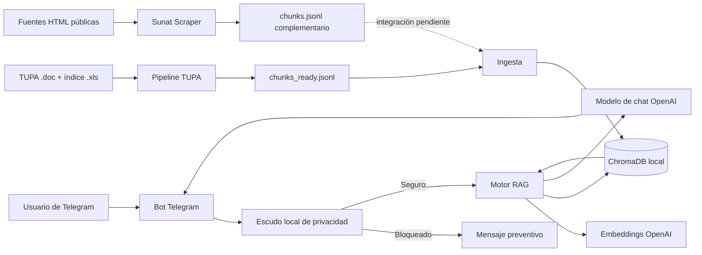

# Asistente RAG de orientación sobre trámites SUNAT

**Documentación técnica y guía de ejecución**  
**Tipo de solución:** prototipo académico de Procesamiento de Lenguaje Natural  
**Repositorio:** https://github.com/giano-montano/hackathon-pln  
**Fecha de revisión:** 16 de julio de 2026

> **Aviso:** Este proyecto no es un canal oficial de SUNAT. El corpus principal procede del TUPA SUNAT 2018 y puede no reflejar cambios normativos posteriores. Las respuestas deben presentarse como orientación y verificarse en los canales oficiales.

## 1. Resumen ejecutivo

El proyecto implementa un asistente conversacional para Telegram que orienta a ciudadanos sobre procedimientos administrativos de SUNAT. La solución emplea una arquitectura RAG (*Retrieval-Augmented Generation*): recupera fragmentos relevantes de un corpus estructurado, construye un contexto verificable y solicita a un modelo de lenguaje que responda únicamente con la información recuperada.

La solución está formada por cuatro bloques:

1. **Pipeline TUPA:** convierte documentos antiguos `.doc` y `.xls`, reconstruye la tabla de procedimientos, valida su cobertura y produce JSONL semántico.
2. **Scraper de fuentes públicas:** descubre, filtra, descarga y procesa páginas HTML oficiales de SUNAT sin utilizar LLM durante la extracción.
3. **Motor RAG:** genera embeddings con OpenAI, almacena los vectores en ChromaDB y recupera los fragmentos más cercanos a la consulta.
4. **Bot y escudo de privacidad:** recibe mensajes mediante Telegram y bloquea localmente credenciales o datos personales antes de que lleguen al modelo de IA.

En el estado actual, el bot ingesta directamente el corpus postprocesado del TUPA. El scraper está implementado como una fuente complementaria, pero sus salidas todavía deben añadirse a `FUENTES` en `bot/rag.py` para formar parte de la recuperación del bot.

## 2. Problema y propuesta de solución

### 2.1 Problema

La información tributaria y administrativa de SUNAT es extensa, técnica y se encuentra distribuida entre documentos tabulares y múltiples páginas web. Para un ciudadano, identificar el procedimiento correcto, sus requisitos, formularios, costo, plazo, canal y autoridad competente puede ser difícil.

Además, un chatbot tributario puede recibir accidentalmente Clave SOL, DNI, RUC, datos bancarios u otras credenciales. Enviar esos datos a un proveedor externo de IA genera un riesgo innecesario.

### 2.2 Propuesta

El proyecto propone un asistente que:

- responde consultas en lenguaje natural;
- recupera información desde fuentes previamente procesadas;
- cita el código y nombre del procedimiento utilizado;
- evita inventar requisitos, costos o plazos;
- informa cuando el corpus no contiene la respuesta;
- bloquea datos personales y credenciales antes del RAG y del LLM;
- mantiene un historial breve solo en memoria para la conversación.

## 3. Objetivos

### 3.1 Objetivo general

Desarrollar un prototipo conversacional basado en RAG que facilite la consulta de procedimientos administrativos de SUNAT y que incorpore una capa preventiva de protección de datos personales.

### 3.2 Objetivos específicos

- Transformar el TUPA consolidado en un corpus estructurado y trazable.
- Preservar la relación entre procedimiento, requisitos, formularios, costo, calificación, plazo, canal, autoridad y recursos.
- Construir chunks semánticos adecuados para embeddings.
- Implementar recuperación vectorial persistente con ChromaDB.
- Generar respuestas breves y sustentadas en el contexto recuperado.
- Implementar un canal de interacción mediante Telegram.
- Detectar y bloquear localmente credenciales, identificadores y datos sensibles.
- Preparar un scraper configurable para incorporar contenido HTML oficial y actualizado.

## 4. Alcance actual

### Incluido

- Procedimientos y servicios del TUPA SUNAT 2018.
- Conversión automática o asistida de `.doc` y `.xls` antiguos.
- Validación de cobertura contra el índice oficial.
- Chunks activos listos para indexación.
- Embeddings de OpenAI y almacenamiento local en ChromaDB.
- Generación con `gpt-4o-mini`.
- Bot de Telegram mediante *long polling*.
- Historial corto por chat en memoria.
- Escudo local para datos personales y credenciales.
- Scraper HTML configurable para múltiples dominios oficiales.
- Pruebas unitarias del scraper y casos demostrativos del escudo.

### Fuera de alcance o pendiente

- Verificación automática de vigencia normativa posterior a 2018.
- Consulta de datos personales, deudas, estado del RUC o trámites autenticados.
- Acceso a SUNAT Operaciones en Línea.
- OCR de documentos escaneados.
- Extracción de PDF, Word o Excel mediante el scraper web.
- Búsqueda híbrida BM25 + vectorial en el bot actual.
- Reordenamiento (*reranking*) de resultados.
- Despliegue productivo con alta disponibilidad, auditoría y monitoreo.
- Integración efectiva de los JSONL del scraper en `bot/rag.py`.

## 5. Arquitectura



### Flujo de una consulta

1. Telegram entrega el mensaje al bot.
2. `shield.inspeccionar()` analiza el texto localmente.
3. Si detecta un dato protegido, el mensaje se descarta y no se envía al LLM.
4. Si el mensaje es seguro, `rag.recuperar()` genera su embedding.
5. ChromaDB retorna los `TOP_K = 6` chunks más cercanos.
6. Los resultados se formatean como fuentes con código y nombre del procedimiento.
7. El modelo genera una respuesta limitada por el *system prompt*.
8. El bot guarda un historial breve de hasta ocho mensajes por chat en memoria.

## 6. Componentes

### 6.1 Pipeline TUPA

**Ubicación:** `tupa_rag_pipeline_code/`

Responsabilidades principales:

- convertir `tupa_consolidado.doc` a `.docx`;
- convertir `relacionTupa-2018.xls` a `.xlsx`;
- leer la tabla de 14 columnas;
- recuperar códigos, nombres, categorías y subprocedimientos del índice;
- reconstruir filas continuadas y procedimientos de varias filas;
- crear documentos padre y chunks semánticos;
- generar diagnósticos y reporte de calidad;
- separar procedimientos eliminados o reemplazados.

El pipeline evita interpretar cualquier numeral como subprocedimiento. Solo usa como jerarquía los códigos presentes en el índice oficial.

### 6.2 Postprocesamiento del corpus

**Archivo:** `tupa_rag_pipeline_code/postprocess_tupa_rag.py`

Funciones:

- valida JSONL, IDs y referencias padre-hijo;
- agrega `is_active`, `status_type` y `status_detail`;
- separa procedimientos activos e inactivos;
- fusiona encabezados aislados con el chunk siguiente;
- conserva chunks breves que contienen información útil;
- produce `chunks_ready.jsonl`, utilizado por el motor RAG.

### 6.3 Scraper de SUNAT

**Ubicación:** `sunat-scraper/`

Pipeline:

```text
Fuentes YAML -> descubrimiento -> filtros -> descarga -> extracción
-> clasificación -> chunking -> exportación JSONL
```

Características:

- sitemap como primera opción;
- recorrido de enlaces acotado como respaldo;
- respeto de `robots.txt`;
- limitación de solicitudes por segundo;
- caché local y ejecución con `--resume`;
- exclusión de zonas autenticadas, archivos no HTML y datos dinámicos;
- extracción principal con Trafilatura;
- respaldo con BeautifulSoup para listas numeradas, FAQ y estructuras complejas;
- clasificación determinista por audiencia y tema;
- deduplicación por URL canónica y hash del texto.

La configuración se encuentra en `sunat-scraper/config/sources.yaml`, por lo que pueden añadirse fuentes sin modificar el código.

### 6.4 Motor RAG

**Archivo:** `bot/rag.py`

Configuración actual:

| Parámetro | Valor |
|---|---|
| Base vectorial | ChromaDB persistente |
| Colección | `tupa_sunat` |
| Embeddings | `text-embedding-3-small` |
| Modelo generativo | `gpt-4o-mini` |
| Recuperación | similitud coseno |
| Resultados | `TOP_K = 6` |
| Fuente activa | `chunks_ready.jsonl` del TUPA |

La ingesta elimina y reconstruye la colección. Por ello es idempotente respecto a la lista de fuentes configurada.

### 6.5 Escudo de privacidad

**Archivo:** `bot/shield.py`

El escudo se ejecuta antes del RAG. Detecta:

- Clave SOL y contraseñas, incluso con algunas ofuscaciones;
- usuario o credenciales de acceso;
- DNI y RUC;
- tarjetas válidas mediante algoritmo de Luhn;
- CCI o cuentas bancarias;
- correos y celulares;
- referencias explícitas a datos sensibles.

El contenido bloqueado no se incluye en los logs. Solo se registra un texto como `BLOQUEADO[dni]` o `BLOQUEADO[clave_sol]`.

> El filtro es deliberadamente conservador. Puede bloquear consultas inocentes que mencionen “contraseña” sin compartirla. Este comportamiento prioriza la prevención de exposición sobre la fluidez de la conversación.

### 6.6 Bot de Telegram

**Archivo:** `bot/main.py`

Comandos disponibles:

- `/start`: presentación y ejemplos;
- `/ayuda` o `/help`: ayuda de uso;
- `/privacidad`: explicación del escudo;
- `/reiniciar`: elimina el historial en memoria del chat.

El bot funciona mediante *long polling* y no requiere exponer un servidor HTTP para la demostración.

## 7. Estructura del repositorio

```text
hackathon-pln/
├── bot/
│   ├── main.py                 # Bot de Telegram
│   ├── rag.py                  # Ingesta, recuperación y generación
│   ├── ingest.py               # Comando de construcción del índice
│   ├── shield.py               # Protección de datos personales
│   └── requirements.txt
├── docs/
│   └── link_proteccion_datos_personales.txt
├── sunat-scraper/
│   ├── config/sources.yaml     # Fuentes, filtros y clasificación
│   ├── src/sunat_scraper/      # Implementación del scraper
│   ├── tests/                  # Pruebas unitarias
│   ├── data/                   # Caché, salidas y reportes
│   ├── pyproject.toml
│   └── README.md
├── tupa_rag_pipeline_code/
│   ├── tupa_pipeline.py
│   ├── postprocess_tupa_rag.py
│   ├── tupa_consolidado.doc
│   ├── relacionTupa-2018.xls
│   └── output_tupa/
│       ├── procedures.jsonl
│       ├── chunks.jsonl
│       ├── quality_report.json
│       └── rag_ready/
│           ├── procedures_ready.jsonl
│           ├── chunks_ready.jsonl
│           ├── procedures_inactive.jsonl
│           ├── chunks_inactive.jsonl
│           └── postprocess_report.json
├── .gitignore
└── README.md                   # Documentación general recomendada
```

## 8. Requisitos

- Python 3.11 o superior para todo el proyecto.
- Microsoft Word con `pywin32` o LibreOffice para convertir el `.doc` antiguo.
- Cuenta y API key de OpenAI.
- Token de un bot de Telegram.
- Acceso a internet para OpenAI, Telegram y ejecución real del scraper.

## 9. Instalación

Desde la raíz del repositorio, en PowerShell:

```powershell
python -m venv .venv
.\.venv\Scripts\Activate.ps1
python -m pip install --upgrade pip

pip install -r .\bot\requirements.txt
pip install -r .\tupa_rag_pipeline_code\requirements.txt
pip install -e ".\sunat-scraper[dev]"
```

No se debe subir `.venv` al repositorio. El `.gitignore` debe contener:

```gitignore
.venv/
.env
chroma_db/
```

Si `.venv` ya fue registrada anteriormente por Git:

```powershell
git rm -r --cached .venv
git commit -m "Remove virtual environment from repository"
git push
```

## 10. Variables de entorno

Crea un archivo `.env` en la raíz:

```env
OPENAI_API_KEY=tu_api_key_de_openai
TELEGRAM_BOT=token_del_bot_de_telegram
```

Para el scraper puede copiarse:

```powershell
Copy-Item .\sunat-scraper\.env.example .\sunat-scraper\.env
```

Nunca se deben guardar en el repositorio:

- tokens de Telegram;
- API keys;
- Clave SOL;
- usuarios o credenciales de SUNAT;
- datos personales reales.

## 11. Ejecución completa

### 11.1 Regenerar el corpus TUPA

Desde `tupa_rag_pipeline_code`:

```powershell
python .\tupa_pipeline.py --tupa-doc ".\tupa_consolidado.doc" --index-xls ".\relacionTupa-2018.xls" --output-dir ".\output_tupa" --target-tokens 450 --max-tokens 650 --debug-rows
```

Después:

```powershell
python .\postprocess_tupa_rag.py --input-dir ".\output_tupa"
```

El archivo final para embeddings es:

```text
tupa_rag_pipeline_code/output_tupa/rag_ready/chunks_ready.jsonl
```

### 11.2 Ejecutar el scraper

Desde `sunat-scraper`:

```powershell
python -m sunat_scraper discover --dry-run
python -m sunat_scraper run --source orientacion --max-pages 150 --requests-per-second 1 --resume
```

Comandos por etapa:

```powershell
python -m sunat_scraper discover
python -m sunat_scraper crawl
python -m sunat_scraper process
```

### 11.3 Construir el índice vectorial

Desde la raíz:

```powershell
python -m bot.ingest
```

Este comando genera o reemplaza:

```text
chroma_db/
```

### 11.4 Levantar el bot

```powershell
python -m bot.main
```

El bot permanecerá activo mediante *long polling* hasta presionar `Ctrl+C`.

## 12. Formatos de datos

### 12.1 Documento padre TUPA

```json
{
  "id": "tupa_1",
  "code": "1",
  "title": "INSCRIPCIÓN EN EL REGISTRO ÚNICO DE CONTRIBUYENTES",
  "metadata": {
    "section": "SECCIÓN I - TRIBUTOS INTERNOS",
    "category": "REGISTRO ÚNICO DE CONTRIBUYENTES",
    "is_active": true
  },
  "fields": {
    "fundamento_legal": "...",
    "requisitos": "...",
    "formularios": "...",
    "costo": "GRATUITO",
    "calificacion": "Automático"
  },
  "page_content": "..."
}
```

### 12.2 Chunk para RAG

```json
{
  "id": "tupa_1_requisitos_001",
  "parent_id": "tupa_1",
  "metadata": {
    "codigo_tupa": "1",
    "procedimiento": "INSCRIPCIÓN EN EL RUC",
    "content_type": "requisitos",
    "is_active": true
  },
  "page_content": "Texto enriquecido que se vectoriza...",
  "raw_text": "Texto extraído del documento..."
}
```

Para indexar:

- embedding: `page_content`;
- metadata de Chroma: `metadata`;
- ID: `id`;
- vínculo al documento completo: `parent_id`.

## 13. Evidencias de calidad del corpus

La ejecución incluida en el repositorio produjo:

| Métrica | Resultado |
|---|---:|
| Entradas del índice | 199 |
| Documentos padre | 199 |
| Cobertura | 100 % |
| Códigos faltantes | 0 |
| Códigos adicionales | 0 |
| Filas desconocidas | 0 |
| Filas huérfanas | 0 |
| Chunks iniciales | 1420 |
| Máximo aproximado | 646 tokens |
| Chunks sobre el máximo | 0 |
| Procedimientos activos | 185 |
| Procedimientos inactivos | 14 |
| Chunks listos para RAG | 1400 |
| Chunks inactivos separados | 18 |

El postprocesamiento reporta además:

- cero IDs duplicados;
- cero referencias padre inexistentes;
- cero chunks vacíos;
- cero encabezados aislados restantes;
- dos encabezados fusionados con contenido posterior.

El archivo `sunat-scraper/data/raw/discovery.json` registra una ejecución de descubrimiento con:

| Métrica | Resultado |
|---|---:|
| URLs descubiertas | 239 |
| URLs aceptadas | 120 |
| URLs rechazadas | 119 |

## 14. Pruebas

### Scraper

Desde `sunat-scraper`:

```powershell
python -m pytest -q
```

La suite cubre:

- parsing de sitemap y sitemaps anidados;
- filtros de inclusión y exclusión;
- clasificación por audiencia y tema;
- extracción de páginas, listas, FAQ y tablas;
- fragmentación semántica;
- exportación JSONL y deduplicación.

### Escudo

Desde la raíz:

```powershell
python .\bot\shield.py
```

El script incluye ejemplos de mensajes permitidos y bloqueados. La salida nunca imprime el contenido de un mensaje real del usuario dentro de los logs de producción.

### Verificación sintáctica

```powershell
python -m compileall bot sunat-scraper/src tupa_rag_pipeline_code
```

## 15. Seguridad y privacidad

### Medidas implementadas

- Escudo local previo al LLM.
- No se registra el texto de mensajes bloqueados.
- Historial efímero en memoria.
- Exclusión de archivos `.env` mediante Git.
- Scraper limitado a páginas públicas.
- Respeto de `robots.txt` y control de velocidad.
- *System prompt* que prohíbe solicitar datos personales.
- Respuesta sustanciada únicamente en contexto recuperado.

### Riesgos pendientes

- Los mensajes permitidos sí se envían a servicios externos de IA y Telegram.
- El historial no está cifrado en memoria.
- Un filtro por expresiones regulares puede tener falsos positivos o falsos negativos.
- No existe autenticación administrativa para operar el bot.
- No hay sistema de auditoría centralizado ni monitoreo de incidentes.
- El corpus TUPA puede estar desactualizado.

## 16. Decisiones técnicas

### JSONL

Permite procesar grandes corpus línea por línea, conservar objetos independientes y facilitar la ingesta por lotes.

### ChromaDB

Es una base vectorial local, simple para una demostración y con persistencia sin requerir infraestructura externa adicional.

### OpenAI

Se utiliza una API para embeddings y generación. El modelo generativo recibe los chunks recuperados y no el corpus completo.

### Telegram

Permite entregar un prototipo conversacional funcional con poca infraestructura y una interfaz conocida.

### Extracción determinista

El scraper no usa LLM para extraer, clasificar o resumir. Esto mejora la trazabilidad y reduce el riesgo de inventar contenido durante la construcción del corpus.

## 17. Limitaciones conocidas

1. **Vigencia:** la fuente principal es el TUPA 2018.
2. **Cobertura del bot:** actualmente solo indexa `chunks_ready.jsonl` del TUPA.
3. **Recuperación:** solo vectorial; los códigos exactos y números legales podrían beneficiarse de BM25.
4. **Sin umbral de rechazo:** el bot consulta siempre los seis resultados y no valida una distancia máxima antes de generar.
5. **Escudo conservador:** bloquea la sola mención de algunas credenciales.
6. **Historial temporal:** se pierde al reiniciar el proceso.
7. **Despliegue local:** ChromaDB y el bot se ejecutan en una sola máquina.
8. **Sin interfaz de fuentes:** el usuario recibe el código del procedimiento, pero no enlaces navegables a cada fragmento del TUPA.
9. **Datos dinámicos:** no deben vectorizarse cronogramas, deudas ni estados de trámites.

## 18. Mejoras propuestas

Prioridad alta:

- integrar `sunat-scraper/data/processed/chunks.jsonl` en `FUENTES`;
- añadir metadata `source`, `url`, `collected_at` y versión de fuente a las respuestas;
- implementar búsqueda híbrida vectorial + BM25;
- aplicar un umbral de similitud y respuesta de abstención;
- construir un conjunto de preguntas de evaluación con respuesta esperada;
- medir `Recall@k`, precisión de citas y fidelidad de la respuesta;
- actualizar el corpus con fuentes oficiales recientes.

Prioridad media:

- agregar *reranking*;
- mostrar botones de categorías en Telegram;
- persistir sesiones de forma segura y limitada;
- incorporar métricas y trazas sin datos personales;
- crear pruebas unitarias para `bot/rag.py`, `bot/main.py` y `bot/shield.py`;
- parametrizar modelos y `TOP_K` mediante variables de entorno.

## 19. Solución de problemas

### Falta `TELEGRAM_BOT`

```text
Falta TELEGRAM_BOT en el .env
```

Crea `.env` en la raíz y agrega el token.

### Error de OpenAI

Verifica `OPENAI_API_KEY`, conexión y saldo disponible. No imprimas la clave en consola ni la subas a Git.

### ChromaDB no existe

Ejecuta:

```powershell
python -m bot.ingest
```

### No se encuentra `chunks_ready.jsonl`

Ejecuta el pipeline y el postprocesamiento, o confirma que exista:

```text
tupa_rag_pipeline_code/output_tupa/rag_ready/chunks_ready.jsonl
```

### Conversión del `.doc`

Instala LibreOffice y agrega `soffice` al `PATH`, o instala `pywin32` y utiliza Microsoft Word:

```powershell
python -m pip install pywin32
```

### PowerShell no reconoce `^`

En PowerShell usa una sola línea o el acento grave `` ` ``. El símbolo `^` corresponde a CMD.

### Conflicto con `.venv` al hacer `git pull`

El entorno virtual no debe versionarse. Elimínalo del índice Git con:

```powershell
git rm -r --cached .venv
git add .gitignore
git commit -m "Remove virtual environment from repository"
git push
```

## 20. Criterios de aceptación del prototipo

- El pipeline recupera todas las entradas del índice TUPA.
- Los diagnósticos de códigos desconocidos y filas huérfanas quedan vacíos.
- Los chunks activos no contienen encabezados aislados ni referencias padre rotas.
- La ingesta crea una colección persistente en ChromaDB.
- El bot responde preguntas de requisitos, costo, plazo y formularios.
- La respuesta cita procedimiento y código.
- El bot se abstiene cuando el contexto no contiene la información.
- Un mensaje con Clave SOL, DNI, RUC, correo o celular se bloquea antes del LLM.
- Los secretos permanecen fuera de Git.

## 21. Conclusión

El proyecto demuestra un pipeline completo de PLN aplicado a un problema público: adquisición y estructuración de fuentes, chunking, embeddings, recuperación, generación controlada e interacción conversacional. Su principal fortaleza es la combinación de trazabilidad del corpus y una puerta local de privacidad antes del uso de IA.

El prototipo es adecuado para una demostración académica. Para un uso real debe actualizarse la vigencia de las fuentes, integrar el contenido web reciente, mejorar la evaluación del RAG y aplicar controles operativos adicionales.
